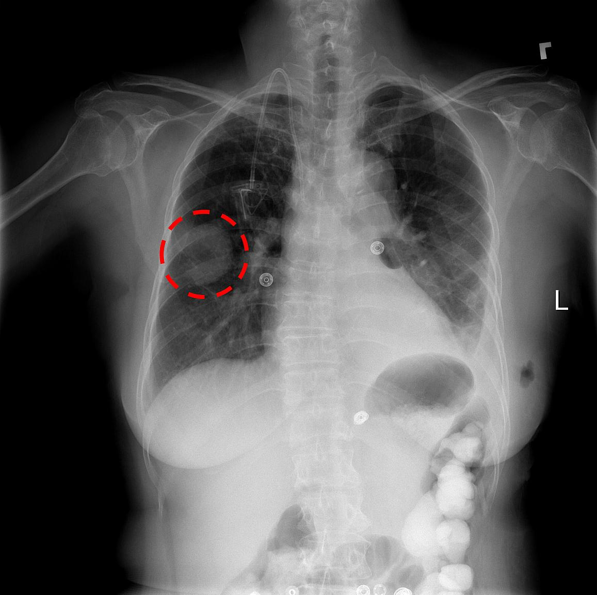

# AI Radiologist GPU


A chest x-ray identifies a lung mass.

GPU version of fast training of a radiologist using Multiple GPUs on a large scale setting using multinodes.


 
## Getting Started

Please refer to this [article](https://www.dell.com/support/article/us/en/04/sln318251/enabling-ai-workloads-in-hpc-environments?lang=en) to install horovod and tensorflow.

### Hardware & Technology Stack 

| Hardware configuration| Software Configuration|
| ------------- |:-------------:| 
| 4 PowerEdge C4140     | Deep Learning Framework: Tensorflow-GPU V1.12.0  | 
| 4 Nvidia V100 32GB SXM2   | Horovod version: 0.16.4      | 
| 2 20 core Intel(R) Xeon(R) Gold 6148 CPU @ 2.40GHz  | MPI version: 4.0.0 with CUDA and UCX Support     | 
| 384 GB RAM, DDR4 2666MHz| CUDA version: 10.1.105    | 
| Lustre file system | NCCL version: 2.4.7 | 
| | Python version: 3.6.8 | 
| | OS and version: RHEL 7.4| 


### Clone this Repo 
```
https://github.com/dellemc-hpc-ai/ai-radiologist-GPU.git
```

```
cd ai-radiologist-GPU
```

Run the following commands from the ai-radiologist-GPU directory.

### Download the dataset

```
./download_dataset.sh
```

you must be able to see ``tars`` folder. 

### Extract the dataset

```
./extract_images.sh
```

You must be able to see all the extracted images inside ``images_all/images`` folder. 

## Running the tests

At this point, you can start to train the cheXNet model using raw images, refer to ``Run the Job`` if you'd like to 
continue training with raw images. However, if you want to train the model with TF Records then
convert the raw images to TF Records. 

### Convert to TF Records 

This will convert your raw images to TF Records which improves the training speed by ~8-15% percent.

```
./write_tfrecords.sh
```

### Run the Job 

Please Ensure that: 
*  You edit the conda env name to your env name in your submission script. 
*  Change the paths from the submission script to your MPI, CUDA, etc build locations.

If you're using slurm as scheduler, submit the corresponding 
script based on the data you want to run. You can change numbers for ``N`` and ``n`` inside the scripts.  

```
sbatch job_submissions/slurm/{raw_1gpu.sh/tfrec_1gpu.sh} 
```


## Related Articles/Blogs

* [Enabling AI Workloads in HPC Environments](https://www.dell.com/support/article/us/en/04/sln318251/enabling-ai-workloads-in-hpc-environments?lang=en)
* [Training an AI Radiologist using Distributed Deep Learning with Nvidia GPUs](https://www.dell.com/support/article/us/en/04/sln318901/training-an-ai-radiologist-using-distributed-deep-learning-with-nvidia-gpus?lang=en)
* [Scaling Performance and Training CheXNet using Bare Metal vs Kubernetes](https://www.dell.com/support/article/us/en/04/sln318899/bare-metal-vs-kubernetes-distributed-training-with-tensorflow?lang=en)
* [Optimization Techniques for Training CheXNet on Dell C4140 with Nvidia V100 GPUs](https://www.dell.com/support/article/us/en/04/sln318898/optimization-techniques-for-training-chexnet-on-dell-c4140-with-nvidia-v100-gpus?lang=en)

## Acknowledgments

* CheXNet Paper 
* Horovod 

